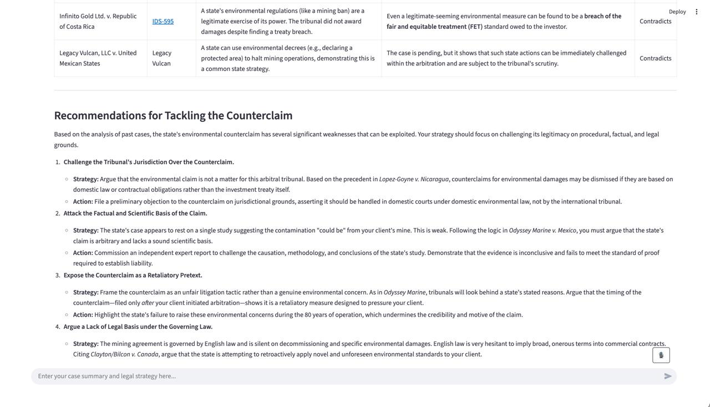

# CAI - Your Strategic Co-Counsel for Arbitration

CAI is an Vertex AI LLM-powered solution that acts as a strategic co-counsel for arbitration lawyers. It helps you build
a winning legal strategy by reviewing your case, identifying factual and legal weaknesses, testing it against
jurisprudence, and recommending stronger alternatives with a compelling visual output.





## The Challenge: Navigating International Arbitration

In the evolving landscape of international arbitration, lawyers are expected to synthesize massive documents, apply the
law, and construct arguments that stand up before tribunals. While some AI tools can answer basic legal questions, few
can test the strength of a legal strategy, deconstruct an argument’s logic, find precedent-based weaknesses, and suggest
superior alternatives.

Arbitration is how the world’s biggest disputes are resolved. When companies clash with governments or massive
infrastructure projects get delayed, they go to arbitration. Billions of dollars, reputations, and diplomatic
relationships are on the line. One weak claim theory can sink it all.

## Our Solution

This tool is designed to be a strategic partner for legal professionals. Users can submit their legal strategy and
relevant case information, and the AI will:

* **Review the legal strategy:** Analyze the core arguments and structure.
* **Identify weaknesses:** Pinpoint factual and legal vulnerabilities.
* **Test against jurisprudence:** Compare the strategy against existing case law.
* **Recommend alternatives:** Suggest stronger, evidence-backed legal arguments.

## Core Features

* **📚 Legal Source Retrieval:** Retrieve all relevant legal sources from Jus Mundi (using available API).
* **📊 Fact Matching:** Measure similarity between your facts & prior cases (metadata & semantic similarities).
* **🧨 Weakness Detection:** Identify opposing case law and highlight potential risks in your strategy.
* **🖥 UI:** Structured visual output for easy comparison and analysis.

## Scenario: Environmental Counterclaim Risk

This prototype is built around environmental counterclaim risks.

## Prerequisites

Ensure you have the following tools installed on your system:

* [Docker](https://docs.docker.com/get-docker/)
* [Google Cloud SDK](https://cloud.google.com/sdk/docs/install)

## Setup and Configuration

1. **Clone the Project:** Clone this repository to your local machine.

2. **Configure Project ID:**
    * Open the file `cai_app.py`.
    * Find the line `PROJECT_ID = "YOUR_PROJECT_ID"` and replace `"YOUR_PROJECT_ID"` with your actual Google Cloud
      Project ID.

3. **Authenticate with Google Cloud:**
    * Run the following command in your terminal to authenticate. This allows the application to access Vertex AI
      services for local development.
      ```bash
      gcloud auth application-default login
      ```
    * Ensure your Google Cloud user or service account has the "Vertex AI User" IAM role (`roles/aiplatform.user`).

## Running Locally with Docker

1. **Build the Docker Image:**
    * In your terminal, navigate to the project's root directory.
    * Run the following command to build the Docker image:
      ```bash
      docker build -t cai-chatbot .
      ```

2. **Run the Docker Container:**
    * Run the following command to start the container. This command also mounts your local gcloud credentials into the
      container for authentication to work.
      ```bash
      docker run -p 8501:8501 -v ~/.config/gcloud:/root/.config/gcloud cai-chatbot
      ```

3. **Open the Application:**
    * Open your web browser and navigate to `http://localhost:8501`.

## Deployment

The provided `Dockerfile` is suitable for deployment to container platforms
like [Google Cloud Run](https://cloud.google.com/run). For a deployed environment, it is recommended to use a dedicated
service account with the appropriate IAM permissions instead of mounting local user credentials.

## Starting the Backend API

To start the backend API locally, navigate to the `backend/src` directory and run:

```bash
adk web
```

We have also deployed the backend API on a virtual machine using nginx as a reverse proxy to provide secure and reliable
access to the service via HTTPS.


## Acknowledgements

This project was created by the AI MEETS LAW team, consisting of **[Niclas Lietzow](https://github.com/nlietzow)**, **[Philipp Davydov](https://github.com/drodel01)**, **[Nils Model](https://github.com/nilsmodel)**, **Marc Pfeiffer**, **Evelina Judin** and **Maximilian Jaques**, during the **[Cambridge Hack-the-Law Hackathon 2025](https://hackthelaw-cambridge.com/)**.

As a hackathon project, it serves as a rapid prototype to demonstrate a proof-of-concept within a limited timeframe.